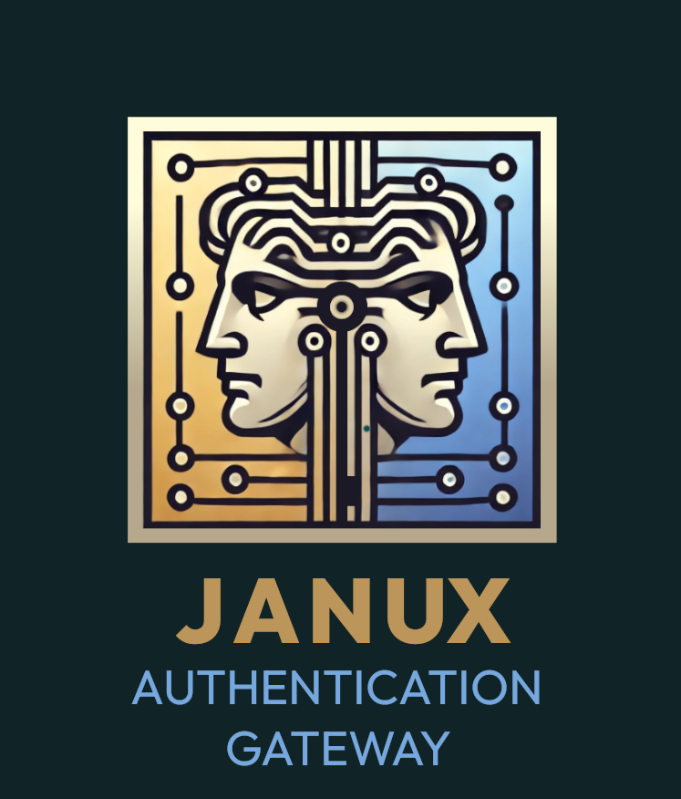

# JANUX Authentiocation Gateway

{ width=200 }

The JANUX Authentication Gateway is a modular and extensible authentication microservice built using FastAPI. It supports user and admin authentication, JWT management, and MongoDB operations via Beanie ODM. This package is designed for developers seeking a robust and scalable authentication solution for their applications.

## Key Features

- JWT-based authentication (access & refresh tokens)
- Role-based access control (RBAC)
- FastAPI-powered API endpoints
- MongoDB with Beanie ODM
- Redis-backed token revocation
- Password hashing with Argon2 & bcrypt
- Admin and user management APIs
- Security-first design
---

## Quick Links

- [PyPI](https://pypi.org/project/janux-auth-gateway)
- [GitHub Repository](https://github.com/fox-techniques/janux-auth-gateway)
- [License](https://github.com/fox-techniques/janux-auth-gateway/blob/main/LICENSE)

Explore the documentation to learn how to customize and make the most of **JANUX Authentiocation Gateway** for your project!
